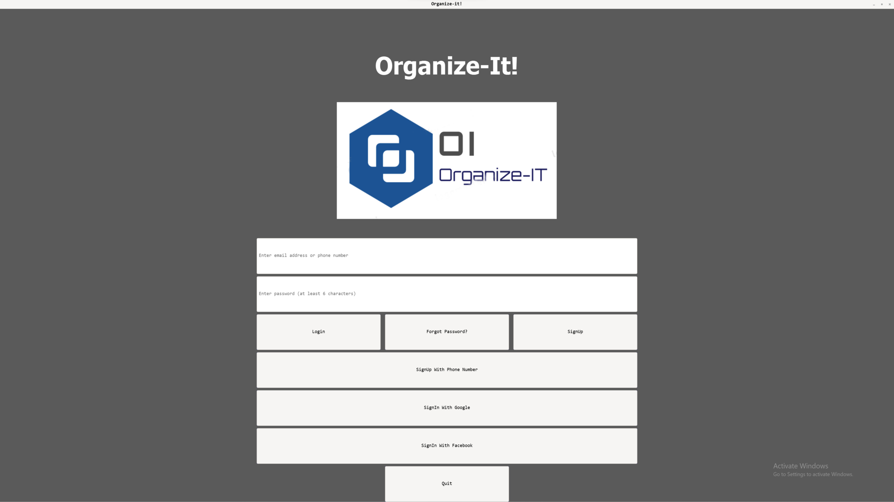
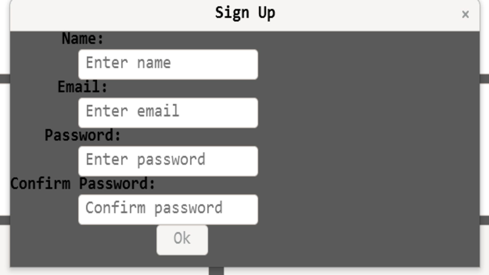
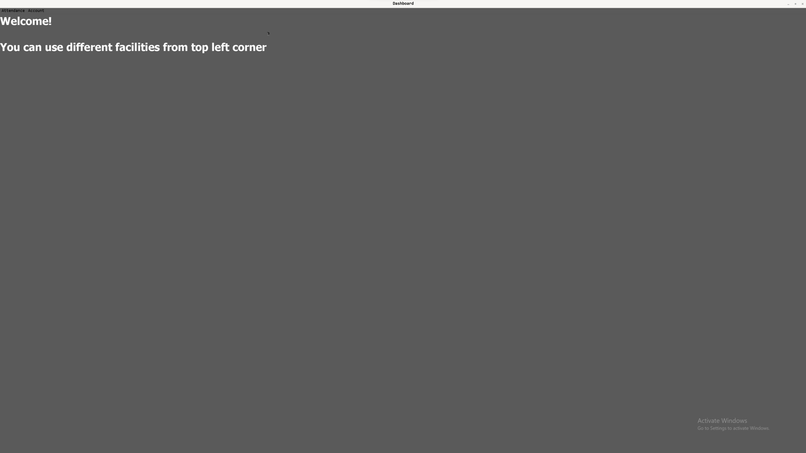
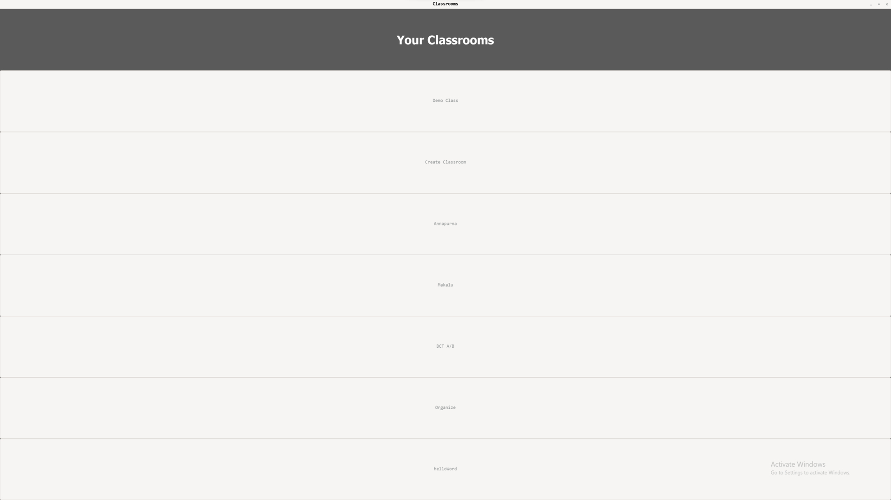
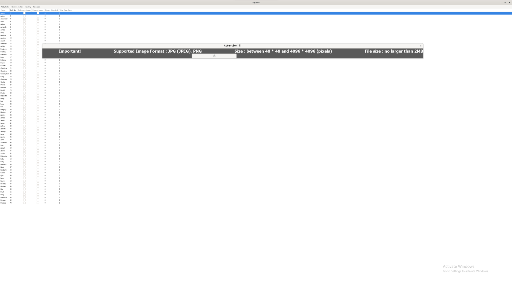

# Organize-IT-Facial_recognition_attendance

This is the Facial Recognition domain covered Organize-It! group of companies.

## Team members

1. Aagaman Sharma Pokharel (PUL078BCT001)\n
2. Ashim Nepal (PUL078BCT020)

## Installation

Just copy the debug folder inside the x64 folder and paste in a location of your device.

## Screenshots

Login Window

SignUp Window

Dashboard window

Classroom window

Attendance window

## Running the program
Run gtk_c_gui_experimental.exe present inside x64/Debug folder after copying the debug folder in your device.

